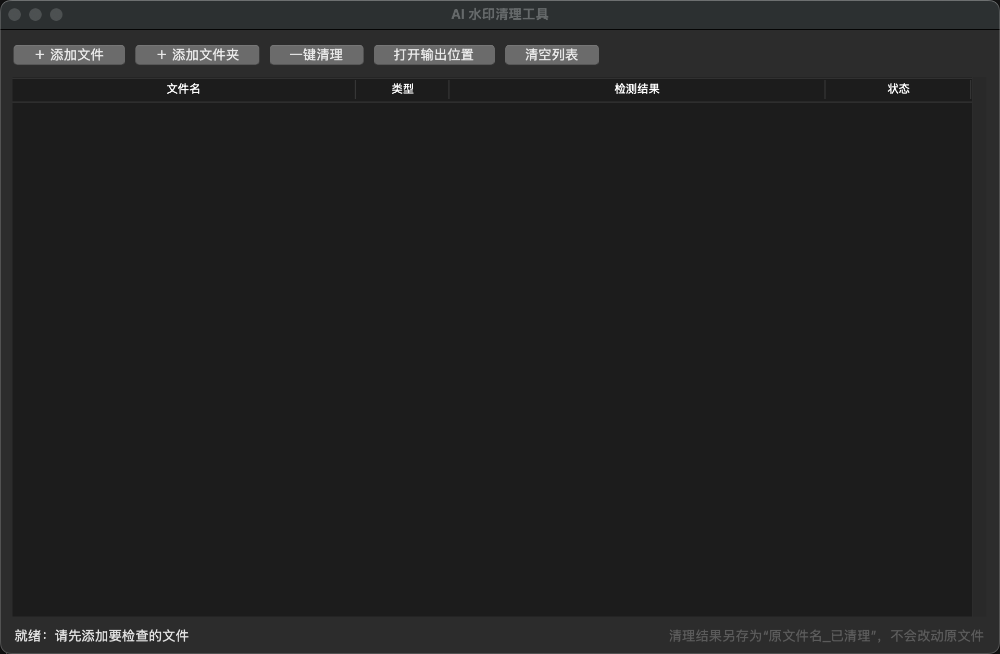

# AI 水印清理工具（图形界面）

给普通人用的 macOS 桌面应用：检测并清除文件里的 AI 痕迹——隐形字符、C2PA 内容凭证、EXIF/XMP 元数据、文档属性。底层复用本仓库 `service/scripts/` 的官方脚本，纯 Python 标准库，无第三方依赖。

## 使用

1. 双击 `gui/WatermarkCleaner.app`（或 `gui/launch.command`）
2. 点「＋ 添加文件」或「＋ 添加文件夹」→ 自动检测
3. 点「一键清理」→ 干净副本另存为「原文件名_已清理」，**不改动原文件**

**独立安装**：把 `WatermarkCleaner.app` 拷到「应用程序」后即可删除本仓库——App 脱离仓库运行时会自动从 GitHub 下载最新代码到 `~/Library/Application Support/AI水印清理工具/`，每次启动检查更新，离线时用已缓存的版本（仅首次启动需要联网）。

支持 md／txt／html／svg／png／jpg／webp／pdf／docx／pptx／epub／mp4／mp3 等 20 余种格式。

## 依赖

- Python 3.10+ 且带 tkinter（macOS：`brew install python-tk`）
- 可选：`qpdf`（PDF 深度清理必需）、`exiftool`（残余元数据清理），`brew install qpdf exiftool`

## 开发

- 设计规格：[SPEC.md](SPEC.md)
- 结构：`core.py`（逻辑层，可独立测试，不依赖 Tk）＋ `app.py`（Tkinter 界面层）
- 测试：`python3 -m unittest discover -s gui/tests -v`（24 项；GUI 冒烟测试跑在子进程里，规避 Tk 9.0 在 macOS 上的原生竞态）
